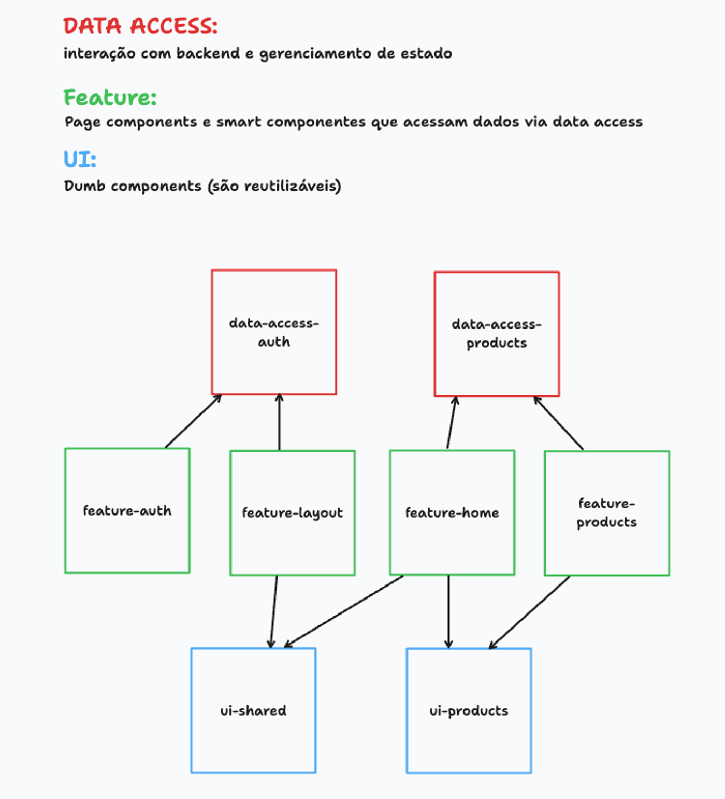

## Arquitetura do projeto

Projeto segue um padrão sugerido pelo NX, tentando focar uma melhor forma de organizar e reaproveitamento de código.

### Tipos de Libs (Camadas)

[NX Library Types](https://nx.dev/concepts/more-concepts/library-types)

### Desenho inicial da arquitetura

### Data Access

Interação com backend e gerenciamento de estado

### Feature

Page components e smart components que acessam dados via data access

### UI

Dumb components que são reutilizáveis